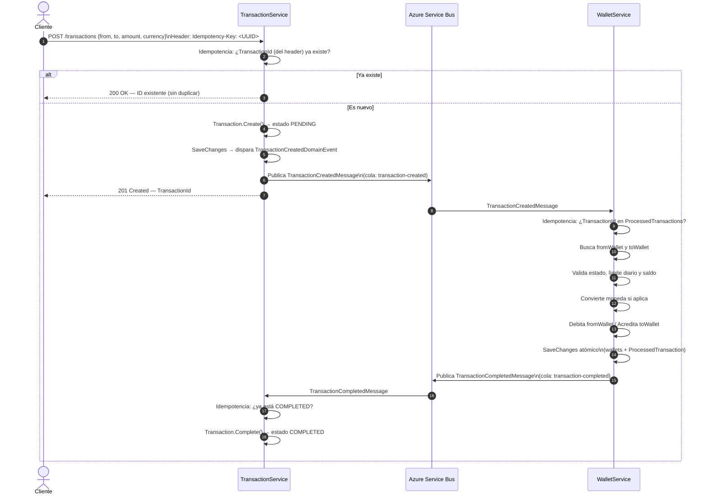
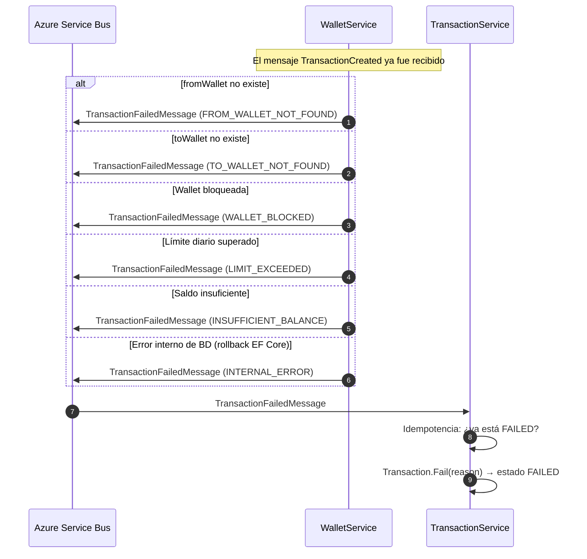
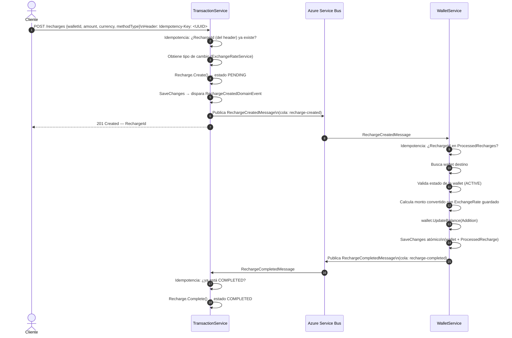
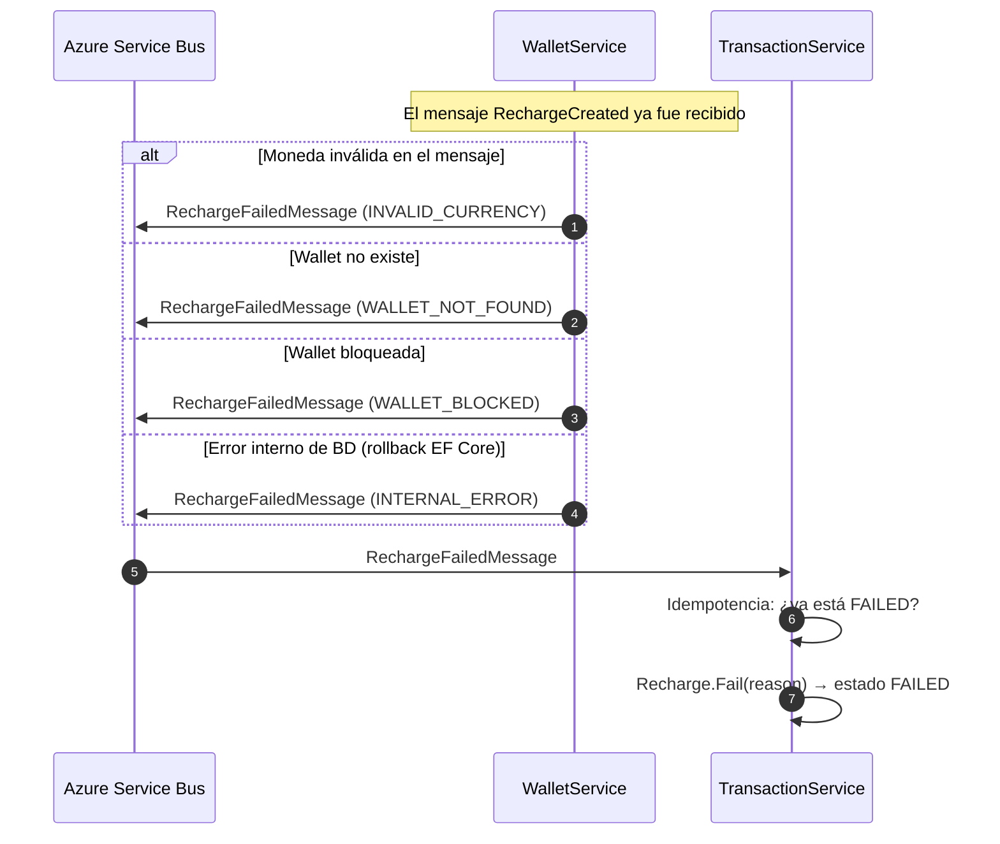
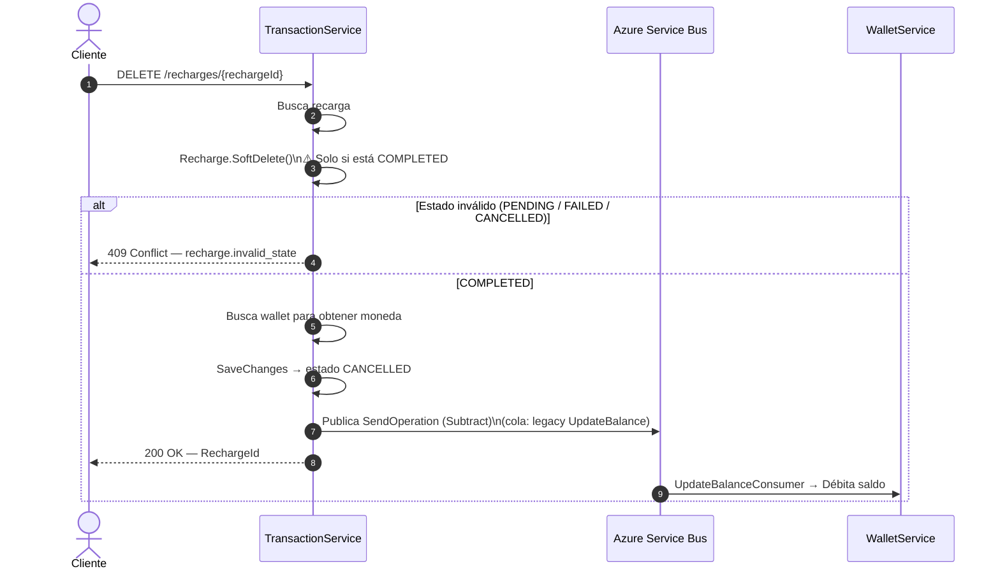
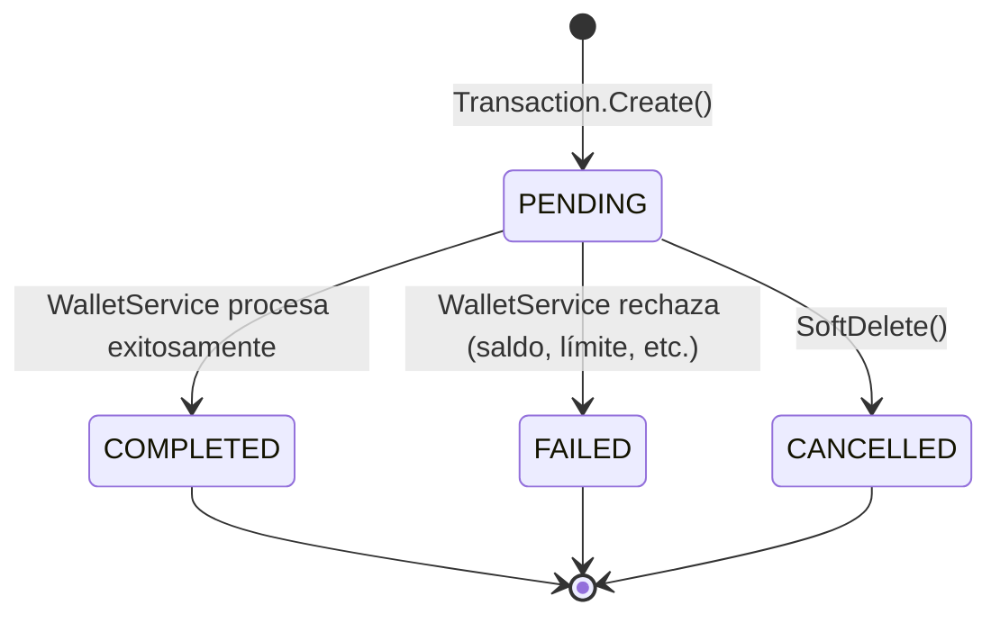
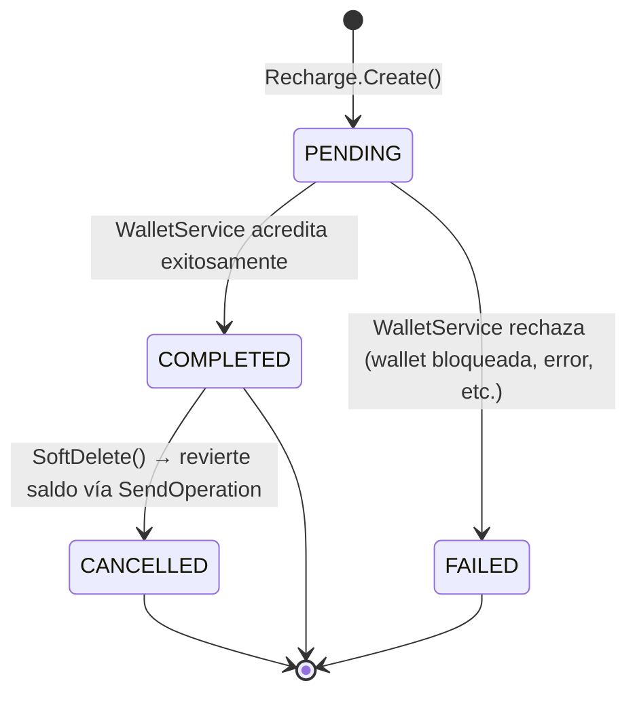

# ProyectoMicroserviciosNetGT


---

## Saga Coreografiada — Transferencia entre Wallets

La transferencia entre wallets se implementa mediante un **Saga Coreografiado** (Choreography-Based Saga). No existe un orquestador central: cada microservicio reacciona de forma autónoma a los eventos publicados en Azure Service Bus y decide el siguiente paso.

La idempotencia se garantiza en dos niveles:
- **TransactionService**: el cliente envía el header `Idempotency-Key: <UUID v4>` en cada petición. Si ya existe una transacción con ese ID, se devuelve el ID sin crear un duplicado. Si el header se omite, se genera un UUID nuevo.
- **WalletService**: la tabla `ProcessedTransactions` registra cada `TransactionId` procesado. Si el bus reenvía el mensaje (retry), el handler lo descarta antes de tocar los saldos.

---

### Flujo Positivo



---

### Flujos Negativos



---

## Saga Coreografiada — Recarga de Wallet

La recarga de saldo también se implementa con el mismo patrón **Choreography-Based Saga**. El cliente crea una recarga en `TransactionService`, y `WalletService` es el responsable de acreditar el saldo y confirmar o rechazar la operación.

La idempotencia se garantiza en dos niveles:
- **TransactionService**: el cliente envía el header `Idempotency-Key: <UUID v4>` en cada petición. Si ya existe una recarga con ese ID, se devuelve el ID sin crear un duplicado. Los handlers `CompleteRecharge` y `FailRecharge` verifican el estado actual antes de modificarlo.
- **WalletService**: la tabla `ProcessedRecharges` registra cada `RechargeId` procesado. Si el bus reenvía el mensaje, el handler lo descarta antes de tocar el saldo.

---

### Flujo Positivo



---

### Flujos Negativos



---

### Cancelación de Recarga (DELETE)

La cancelación solo está permitida cuando la recarga ya está en estado `COMPLETED`. Al cancelar, `TransactionService` envía una operación de débito a `WalletService` vía la cola existente (`SendOperation`) para revertir el saldo acreditado.



---

### Contratos de Mensajes (Azure Service Bus — Basic tier, solo colas)

#### Transferencia entre Wallets

| Cola | Publicado por | Consumido por | Tipo de mensaje |
|---|---|---|---|
| `transaction-created` | TransactionService | WalletService | `TransactionCreatedMessage` |
| `transaction-completed` | WalletService | TransactionService | `TransactionCompletedMessage` |
| `transaction-failed` | WalletService | TransactionService | `TransactionFailedMessage` |

#### Recarga de Wallet

| Cola | Publicado por | Consumido por | Tipo de mensaje |
|---|---|---|---|
| `recharge-created` | TransactionService | WalletService | `RechargeCreatedMessage` |
| `recharge-completed` | WalletService | TransactionService | `RechargeCompletedMessage` |
| `recharge-failed` | WalletService | TransactionService | `RechargeFailedMessage` |

Todos los tipos de mensaje llevan el atributo `[MessageUrn]` con un URN canónico para que MassTransit enrute correctamente entre servicios sin compartir ensamblados.

---

### Idempotencia ante reintentos de ASB

#### Transferencia

| Evento reenviado | Comportamiento |
|---|---|
| `TransactionCreated` (reintento) | WalletService consulta `ProcessedTransactions` → ya existe → descarta sin modificar saldos |
| `TransactionCompleted` (reintento) | TransactionService verifica `Status == COMPLETED` → ignora sin error |
| `TransactionFailed` (reintento) | TransactionService verifica `Status == FAILED` → ignora sin error |
| `POST /transactions` con mismo `Idempotency-Key` header | TransactionService devuelve el ID sin crear una nueva transacción |

#### Recarga

| Evento reenviado | Comportamiento |
|---|---|
| `RechargeCreated` (reintento) | WalletService consulta `ProcessedRecharges` → ya existe → descarta sin acreditar saldo |
| `RechargeCompleted` (reintento) | TransactionService verifica `Status == COMPLETED` → ignora sin error |
| `RechargeFailed` (reintento) | TransactionService verifica `Status == FAILED` → ignora sin error |
| `POST /recharges` con mismo `Idempotency-Key` header | TransactionService devuelve el ID sin crear una nueva recarga |

#### Wallet

| Petición repetida | Comportamiento |
|---|---|
| `POST /wallets` con mismo `Idempotency-Key` header | WalletService busca la wallet por ID → ya existe → devuelve el ID sin crear una nueva wallet |

---

### Estados de la Transacción



### Estados de la Recarga



---

## Autenticación y Autorización

La autenticación usa **Azure AD (Entra ID)** con tokens JWT Bearer. Cada servicio valida el token contra el endpoint OIDC del tenant (`https://login.microsoftonline.com/{tenantId}/v2.0`). Los roles se leen del claim `roles` del token.

### Roles

| Rol | Descripción |
|---|---|
| `User-App` | Usuario final de la aplicación |
| `Seller` | Vendedor/operador que gestiona recargas |
| `Support` | Soporte técnico con permisos de administración |

### Endpoints — TransactionService

| Método | Endpoint | Rol requerido | Idempotencia |
|---|---|---|---|
| `POST` | `/api/transactions` | `User-App` | `Idempotency-Key` header (UUID) |
| `GET` | `/api/transactions/wallet/{fromWalletId}` | `User-App` | — |
| `DELETE` | `/api/transactions/{transactionId}` | `Support` | — |
| `POST` | `/api/recharges` | `Seller` | `Idempotency-Key` header (UUID) |
| `GET` | `/api/recharges/wallet/{walletId}` | `Seller`, `User-App` | — |
| `DELETE` | `/api/recharges/{rechargeId}` | `Support` | — |

### Endpoints — WalletService

| Método | Endpoint | Rol requerido | Idempotencia |
|---|---|---|---|
| `POST` | `/api/wallets` | `Support` | `Idempotency-Key` header (UUID) |
| `GET` | `/api/wallets/{walletId}` | cualquier rol autenticado | — |
| `PATCH` | `/api/wallets/{walletId}` | cualquier rol autenticado | — |
| `DELETE` | `/api/wallets/{walletId}` | `Support` | — |

---

## Cómo Ejecutar el Proyecto

### Prerrequisitos

| Herramienta | Versión mínima |
|---|---|
| [.NET SDK](https://dotnet.microsoft.com/download) | 10.0 |
| [Azure CLI](https://learn.microsoft.com/cli/azure/install-azure-cli) | cualquiera reciente |
| [EF Core CLI](https://learn.microsoft.com/ef/core/cli/dotnet) | `dotnet tool install -g dotnet-ef` |
| SQL Server | 2019+ (o Azure SQL) |
| Azure Service Bus | Basic tier |
| Azure Cosmos DB | API for NoSQL |
| Azure Key Vault | — |

---

### Infraestructura Azure requerida

#### Secretos en Key Vault

Crea los siguientes secretos en tu Key Vault (`https://azkvadrian1.vault.azure.net/`):

| Nombre del secreto | Descripción |
|---|---|
| `WalletSqlServerConnection` | Connection string de SQL Server para WalletService |
| `WalletServiceBusConnectionString` | Connection string de Azure Service Bus para WalletService |
| `TransactionServiceBusConnectionString` | Connection string de Azure Service Bus para TransactionService |
| `CosmosConnection` | Connection string de Cosmos DB para TransactionService |

#### Colas en Azure Service Bus

Crea las siguientes colas (Basic tier):

```
transaction-created
transaction-completed
transaction-failed
recharge-created
recharge-completed
recharge-failed
wallet-update-balance
```

#### Base de datos Cosmos DB

Crea la base de datos `cosmosgtdata` con dos contenedores:

| Contenedor | Partition key |
|---|---|
| `Transactions` | `/FromWalletId` |
| `Recharges` | `/WalletId` |

---

### Configuración

Ajusta los valores en `appsettings.json` de cada servicio si es necesario:

**WalletService.Api/appsettings.json**
```json
"KeyVault": { "VaultUrl": "https://<tu-keyvault>.vault.azure.net/" },
"AzureAd": {
  "TenantId": "<tenant-id>",
  "ClientId": "<app-registration-client-id>"
}
```

**TransactionService.Api/appsettings.json**
```json
"KeyVault": { "VaultUrl": "https://<tu-keyvault>.vault.azure.net/" },
"CosmosDatabaseName": "cosmosgtdata",
"AzureAd": {
  "TenantId": "<tenant-id>",
  "ClientId": "<app-registration-client-id>"
}
```

---

### Migraciones — WalletService (SQL Server)

```bash
# Desde la raíz del repositorio
cd WalletService

# Aplicar migraciones (crea tablas en SQL Server)
dotnet ef database update \
  --project WalletService.Infrastructure \
  --startup-project WalletService.Api

# Alternativamente, aplicar el script SQL directamente:
# sqlcmd -S <servidor> -d <base-de-datos> -i scripts/InitialCommit.sql
```

> TransactionService usa Cosmos DB — EF Core crea las colecciones automáticamente al iniciar.

---

### Ejecución Local

Autenticación con Azure (necesario para Key Vault con `DefaultAzureCredential`):

```bash
az login
```

Levantar los servicios en terminales separadas:

```bash
# 1. MockCurrency (tipos de cambio)
cd MockCurrency
dotnet run --urls "http://localhost:5000"

# 2. WalletService
cd WalletService/WalletService.Api
dotnet run --urls "http://localhost:5072"

# 3. TransactionService
cd TransactionService/TransactionService.Api
dotnet run --urls "http://localhost:5071"
```

---

### Ejecución con Docker

```bash
# MockCurrency
docker build -t mockcurrency ./MockCurrency
docker run -p 5000:8080 mockcurrency

# WalletService
docker build -t walletservice ./WalletService
docker run -p 5072:8080 \
  -e AZURE_CLIENT_ID=<managed-identity-client-id> \
  walletservice

# TransactionService
docker build -t transactionservice ./TransactionService
docker run -p 5071:8080 \
  -e AZURE_CLIENT_ID=<managed-identity-client-id> \
  transactionservice
```

> En Docker, `DefaultAzureCredential` usa la variable de entorno `AZURE_CLIENT_ID` para autenticarse con una Managed Identity. En desarrollo local usa `az login`.


