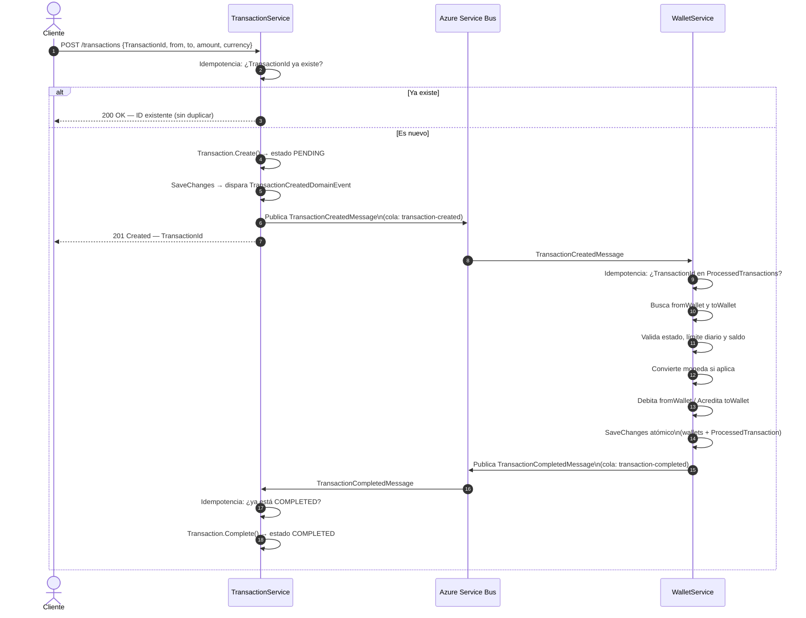
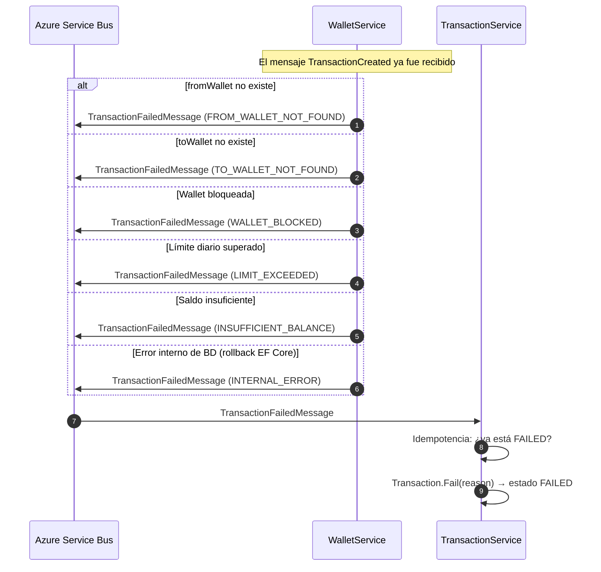
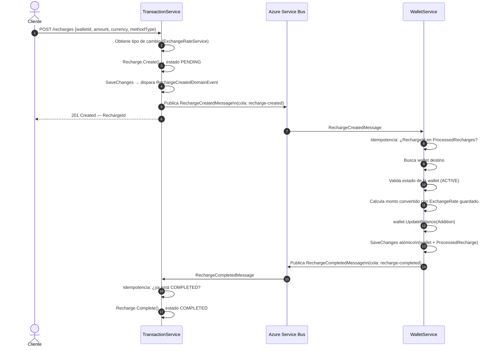
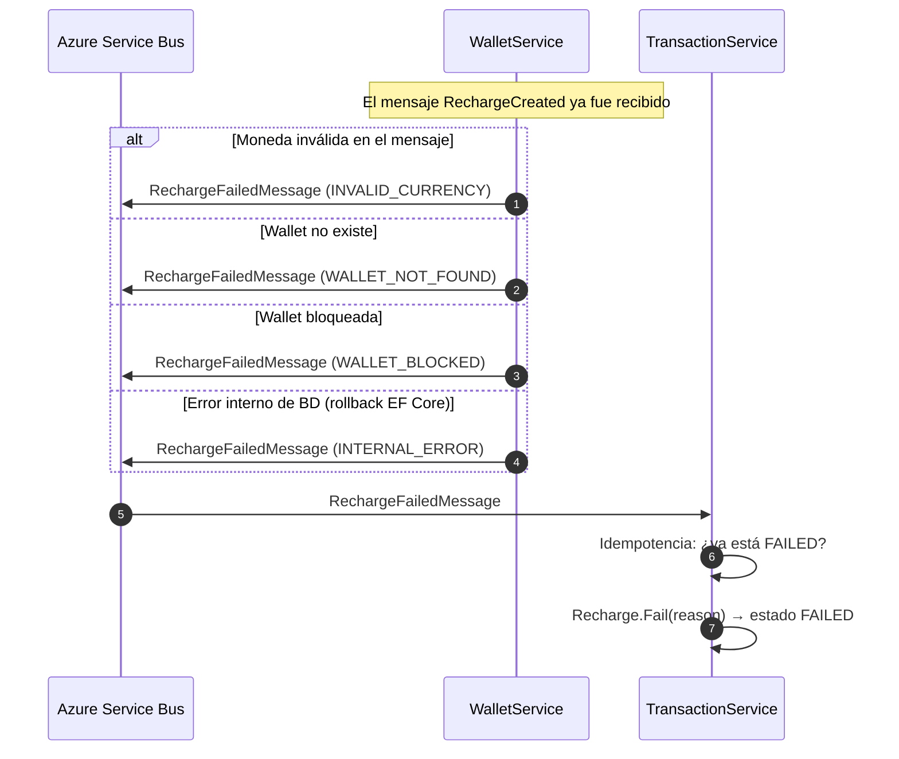
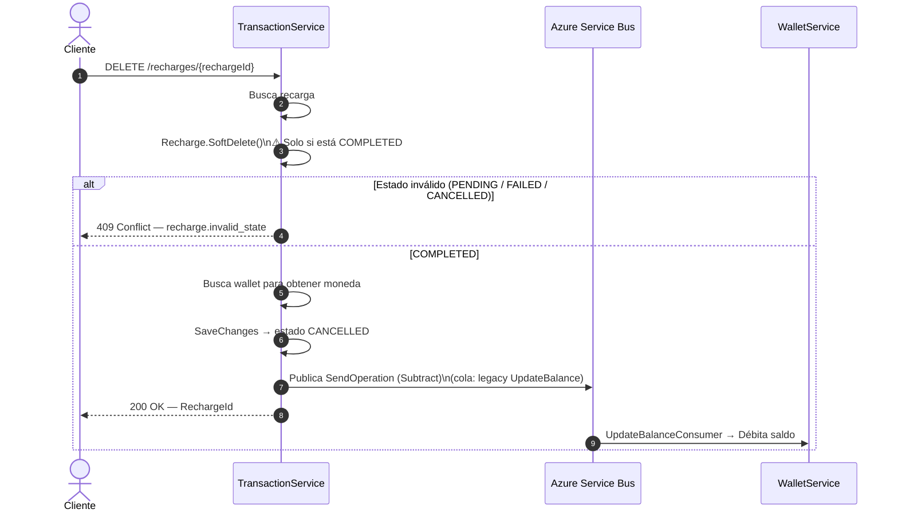
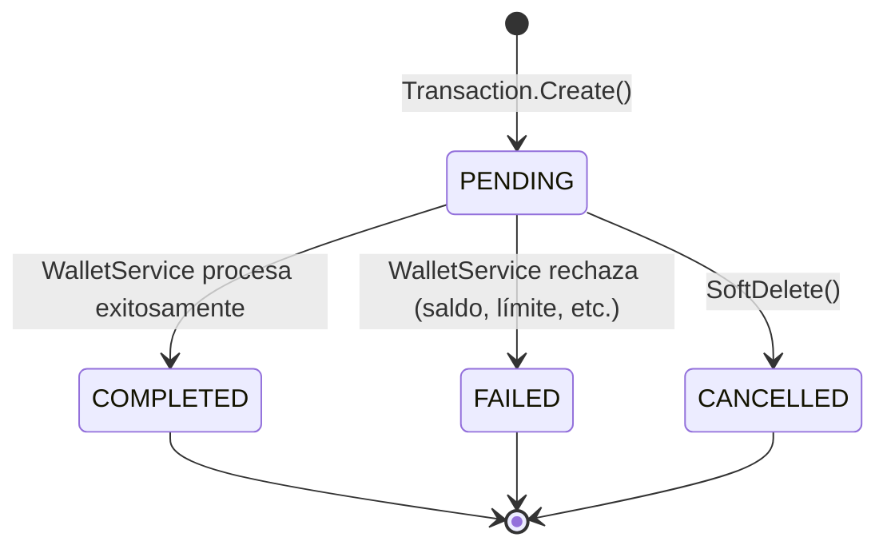
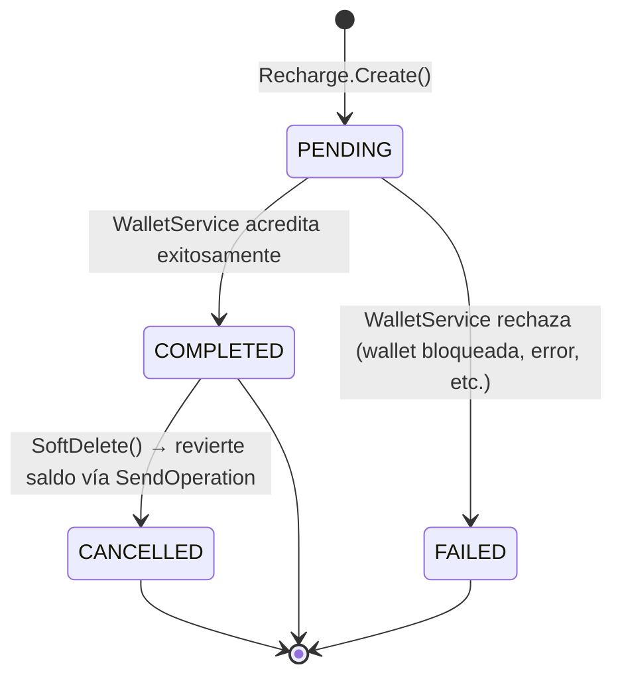

# ProyectoMicroserviciosNetGT

---

## Saga Coreografiada — Transferencia entre Wallets

La transferencia entre wallets se implementa mediante un **Saga Coreografiado** (Choreography-Based Saga). No existe un orquestador central: cada microservicio reacciona de forma autónoma a los eventos publicados en Azure Service Bus y decide el siguiente paso.

La idempotencia se garantiza en dos niveles:
- **TransactionService**: el cliente envía un `TransactionId` (UUID v4) junto a cada petición. Si ya existe, se devuelve el ID sin crear un duplicado.
- **WalletService**: la tabla `ProcessedTransactions` registra cada `TransactionId` procesado. Si el bus reenvía el mensaje (retry), el handler lo descarta antes de tocar los saldos.

---

### Flujo Positivo

---

### Flujos Negativos

---

## Saga Coreografiada — Recarga de Wallet

La recarga de saldo también se implementa con el mismo patrón **Choreography-Based Saga**. El cliente crea una recarga en `TransactionService`, y `WalletService` es el responsable de acreditar el saldo y confirmar o rechazar la operación.

La idempotencia se garantiza en dos niveles:
- **TransactionService**: los handlers `CompleteRecharge` y `FailRecharge` verifican el estado actual antes de modificarlo. Si ya está en el estado destino, ignoran el evento sin error.
- **WalletService**: la tabla `ProcessedRecharges` registra cada `RechargeId` procesado. Si el bus reenvía el mensaje, el handler lo descarta antes de tocar el saldo.

---

### Flujo Positivo

---

### Flujos Negativos

---

### Cancelación de Recarga (DELETE)

La cancelación solo está permitida cuando la recarga ya está en estado `COMPLETED`. Al cancelar, `TransactionService` envía una operación de débito a `WalletService` vía la cola existente (`SendOperation`) para revertir el saldo acreditado.

---

### Contratos de Mensajes (Azure Service Bus — Basic tier, solo colas)

#### Transferencia entre Wallets

| Cola | Publicado por | Consumido por | Tipo de mensaje |
|---|---|---|---|
| `transaction-created` | TransactionService | WalletService | `TransactionCreatedMessage` |
| `transaction-completed` | WalletService | TransactionService | `TransactionCompletedMessage` |
| `transaction-failed` | WalletService | TransactionService | `TransactionFailedMessage` |

#### Recarga de Wallet

| Cola | Publicado por | Consumido por | Tipo de mensaje |
|---|---|---|---|
| `recharge-created` | TransactionService | WalletService | `RechargeCreatedMessage` |
| `recharge-completed` | WalletService | TransactionService | `RechargeCompletedMessage` |
| `recharge-failed` | WalletService | TransactionService | `RechargeFailedMessage` |

Todos los tipos de mensaje llevan el atributo `[MessageUrn]` con un URN canónico para que MassTransit enrute correctamente entre servicios sin compartir ensamblados.

---

### Idempotencia ante reintentos de ASB

#### Transferencia

| Evento reenviado | Comportamiento |
|---|---|
| `TransactionCreated` (reintento) | WalletService consulta `ProcessedTransactions` → ya existe → descarta sin modificar saldos |
| `TransactionCompleted` (reintento) | TransactionService verifica `Status == COMPLETED` → ignora sin error |
| `TransactionFailed` (reintento) | TransactionService verifica `Status == FAILED` → ignora sin error |
| `POST /transactions` con mismo `TransactionId` | TransactionService devuelve el ID sin crear una nueva transacción |

#### Recarga

| Evento reenviado | Comportamiento |
|---|---|
| `RechargeCreated` (reintento) | WalletService consulta `ProcessedRecharges` → ya existe → descarta sin acreditar saldo |
| `RechargeCompleted` (reintento) | TransactionService verifica `Status == COMPLETED` → ignora sin error |
| `RechargeFailed` (reintento) | TransactionService verifica `Status == FAILED` → ignora sin error |

---

### Estados de la Transacción

### Estados de la Recarga

